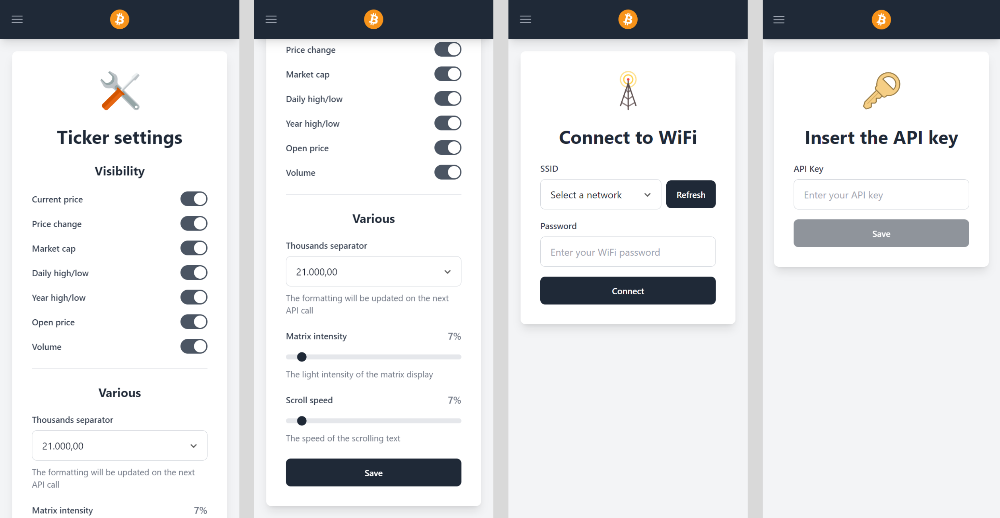

# 💰 LED Matrix Bitcoin Ticker with ESP8266

---

## 🎯 What is LED Matrix Bitcoin Ticker?

LED Matrix Bitcoin Ticker is a dynamic **cryptocurrency display system** that transforms an ESP8266 microcontroller and MAX7219 LED matrix into a real-time Bitcoin information ticker. It fetches and displays up-to-date Bitcoin data including current price, daily change, yearly highs/lows, and more, providing an informative and visually appealing crypto dashboard.

### 🌟 Key Highlights

- 📈 **Real-Time Crypto Data**: Displays comprehensive Bitcoin metrics and trends
- 🌐 **WiFi Connectivity**: Fetches live data from financial APIs
- 🎛️ **Web-Based Configuration**: User-friendly web interface for setup and customization
- 🔧 **Customizable Display**: Adjustable scroll speed, pinout, and data selection
- 📱 **Responsive Web App**: Modern Vue.js interface for device management
- ⚡ **Low-Power Operation**: Efficient ESP8266-based design for continuous monitoring

---

## 📸 Screenshots

### 📱 Web Configuration Interface

---

## 🏗️ Architecture

LED Matrix Bitcoin Ticker consists of three main components:

### 🔌 ESP8266 Microcontroller
- IoT microcontroller handling WiFi connectivity and data fetching
- Controls MAX7219 LED matrix for display output
- Runs embedded web server for configuration

### 📺 MAX7219 LED Matrix
- Dot matrix display module for scrolling text and data
- Configurable number of modules for expanded display
- Displays Bitcoin price, changes, and statistics

### 🎨 Web Configuration App (Vue.js)
- Modern web application for device setup and management
- WiFi credential input and API key configuration
- Data selection and display customization options

### 🔄 Data Flow

1. **🌐 API Fetching**: ESP8266 connects to WiFi and fetches Bitcoin data from financial APIs
2. **📊 Data Processing**: Microcontroller processes JSON responses and formats display data
3. **📺 Matrix Display**: Information scrolls across LED matrix with customizable speed
4. **🎛️ Configuration**: Web app allows users to modify settings via HTTP interface

---

## 🛠️ Tech Stack

### 🎨 Frontend (Configuration Web App)
- **Vue 3** - Progressive JavaScript framework
- **Vite** - Fast build tool and development server
- **Tailwind CSS** - Utility-first CSS framework
- **PostCSS** - CSS processing tool

### 🔧 Microcontroller (ESP8266)
- **ESP8266** - WiFi-enabled microcontroller
- **PlatformIO** - Professional development environment
- **Arduino Framework** - Embedded programming framework

### 📚 Libraries
- **MD_Parola** - LED matrix text effects library
- **MD_MAX72XX** - MAX7219 LED matrix driver
- **ESPAsyncWebServer** - Asynchronous web server
- **ArduinoJson** - JSON parsing library
- **LittleFS** - Lightweight filesystem

---

## 📋 Features

### 🎯 Core Functionality
- ✅ **Real-Time Price Display** - Live Bitcoin price updates
- ✅ **Comprehensive Metrics** - Price, daily change, yearly high/low, opening price
- ✅ **WiFi Auto-Connect** - Automatic network connection with stored credentials
- ✅ **Web Configuration** - Browser-based setup and customization
- ✅ **Data Persistence** - Settings stored in flash memory

### 📊 Display Options
- 📈 **Customizable Data** - Select which metrics to display
- ⏱️ **Scroll Speed Control** - Adjustable text scrolling speed
- 🔢 **Module Configuration** - Support for multiple LED matrix modules
- 📍 **Pinout Flexibility** - Configurable hardware connections

### 🎨 User Experience
- 🌐 **Access Point Mode** - Initial setup via WiFi hotspot
- 📱 **Mobile Friendly** - Responsive web interface
- 🔄 **Live Updates** - Real-time data refresh
- 🛠️ **Easy Customization** - Simple web-based configuration

---

## 🚀 Quick Start

### 📋 Prerequisites

- 🔌 **ESP8266 Microcontroller**
- 📺 **MAX7219 LED Matrix**
- 🔋 **Power Supply** for ESP8266
- 🪜 **Jumper Wires** for connections
- 💻 **PlatformIO** extension for VS Code
- 🌐 **WiFi Network** for internet access

### 🔧 Configuration

#### Hardware Setup

1. 🔌 Connect the MAX7219 LED Matrix to ESP8266 using jumper wires
2. 🔍 Verify pinout connections (CLK, DATA, CS pins)
3. ⚡ Power the ESP8266 via USB or external supply

#### Software Setup

1. 💻 Install PlatformIO extension in VS Code
2. 📥 Clone/download the source code repository
3. 📂 Open project in PlatformIO
4. 🏗️ Build and upload filesystem image (`Build Filesystem Image` → `Upload Filesystem Image`)
5. 🚀 Build and upload firmware (`Build` → `Upload`)

#### Initial Configuration

1. 🔄 After reboot, ESP8266 creates `Bitcoin-Ticker` WiFi access point
2. 🌐 Connect to the hotspot and navigate to `192.168.4.1`
3. 📶 Enter your WiFi credentials to connect to network
4. 🔑 Obtain free API key from [financialmodelingprep.com](https://site.financialmodelingprep.com)
5. ⚙️ Enter API key in the web interface
6. 🎨 Customize display settings (data to show, scroll speed, etc.)

## 🎯 Usage

### 📺 Display Operation

The LED matrix automatically:
- 🌐 Connects to configured WiFi network
- 📡 Fetches Bitcoin data from financial API
- 📊 Processes and formats data for display
- 🔄 Scrolls information across the matrix
- ⏰ Updates data at regular intervals

### 🎛️ Configuration Management

- 📶 **WiFi Settings**: Update network credentials via web interface
- 🔑 **API Configuration**: Change or update API key
- 📊 **Display Options**: Select which data points to display
- ⏱️ **Scroll Speed**: Adjust text scrolling speed
- 📍 **Hardware Pins**: Modify pin connections if needed

### 📊 Displayed Information

- 💰 **Current Price**: Live Bitcoin price in USD
- 📈 **Daily Change**: Percentage change from previous day
- 📊 **Yearly High/Low**: Annual price extremes
- 🏁 **Opening Price**: Daily opening price
- 📉 **Additional Metrics**: Volume, market cap, etc.

---

## 📄 License

This project is licensed under the **MIT License** - see the [LICENSE](LICENSE) file for details.

---

## 🙏 Acknowledgments

- 💰 **Financial Modeling Prep** for providing free financial APIs
- 🔧 **PlatformIO** for the excellent development environment
- 📺 **MajicDesigns** for the MD_Parola and MD_MAX72XX libraries
- 🌐 **ESP8266 Community** for WiFi and HTTP libraries
- 📄 **bblanchon** for ArduinoJson and StreamUtils libraries
- 🖥️ **me-no-dev** for the ESPAsyncWebServer library
- 🎨 **Vue.js Team** for the progressive framework
- ⚡ **Vite Team** for the fast build tool